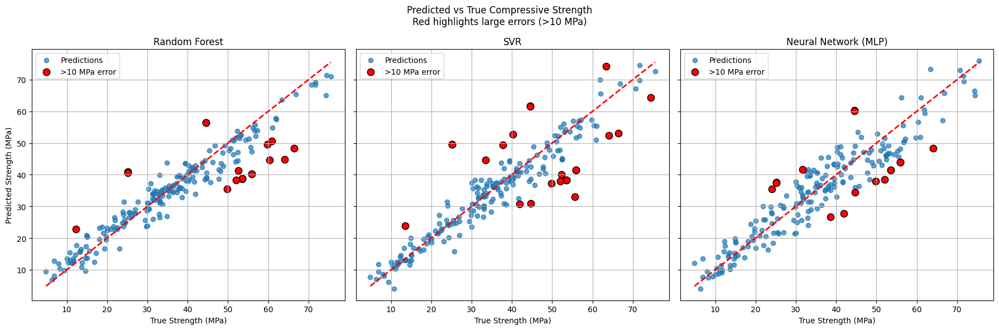
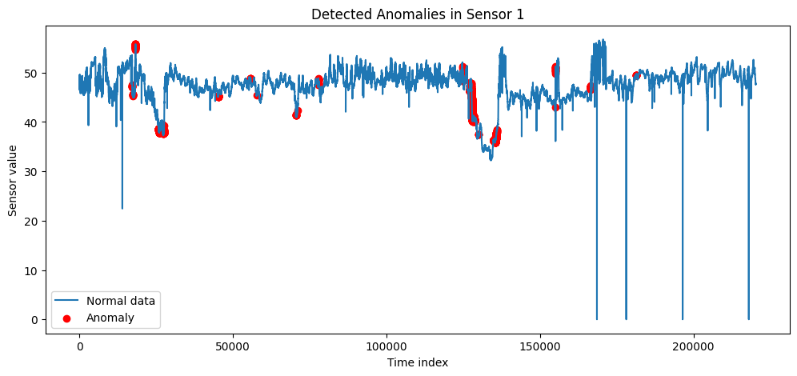
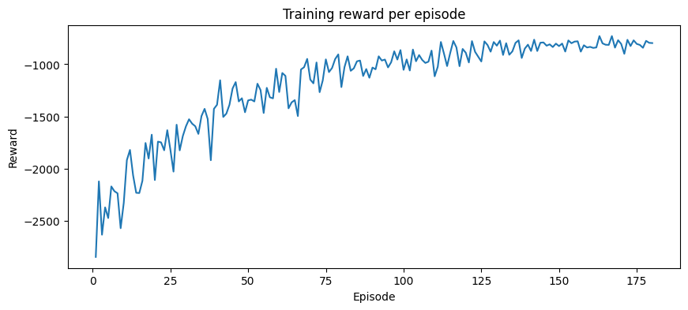

# Machine Learning for Engineering Systems

Python notebooks applying supervised learning, unsupervised learning, and
reinforcement learning to three engineering problems. The work was completed
as part of **TMM4128 – Machine Learning for Engineers** at NTNU in spring 2026.

The assignments were submitted by a team of three engineering students. I was
the primary technical contributor and carried out most of the data preparation,
Python implementation, model training, evaluation, visualisation, and written
synthesis. The other team members contributed through discussion and feedback,
and the notebooks remain credited as group work.

This repository contains the technical work from the course. Shorter project
summaries and the wider mechanical-engineering context are presented separately
in the project case study on my portfolio website.

---

## Overview

The project consists of three connected studies:

| Learning paradigm | Engineering problem | Main methods |
|---|---|---|
| Supervised learning | Predict concrete compressive strength from mix composition and curing age | Linear regression, Ridge, SVR, Random Forest, MLP and ensemble regression |
| Unsupervised learning | Identify unusual operating patterns in industrial pump sensor data | PCA, K-Means, DBSCAN and Isolation Forest |
| Reinforcement learning | Control heating and ventilation in a simplified building simulation | PyTorch Deep Q-Network and rule-based baselines |

The purpose was not to produce deployment-ready systems, but to select suitable
methods, compare their behaviour, interpret engineering results, and identify
the limitations of data-driven models.

---

## 1. Supervised Learning: Concrete Strength Prediction

The first study uses the UCI Concrete Compressive Strength dataset to predict
compressive strength from eight numerical inputs:

- Cement
- Blast-furnace slag
- Fly ash
- Water
- Superplasticizer
- Coarse aggregate
- Fine aggregate
- Curing age

The dataset contains **1,030 concrete mixes** with measured compressive strength
in MPa. Several regression methods were compared using cross-validation and a
held-out test set.

### Test Results

| Model | MAE | RMSE | R² |
|---|---:|---:|---:|
| Random Forest | 3.73 MPa | 5.35 MPa | 0.889 |
| SVR | 3.93 MPa | 6.02 MPa | 0.860 |
| Neural network | 4.67 MPa | 5.86 MPa | 0.867 |
| Voting ensemble | **3.63 MPa** | **5.15 MPa** | **0.897** |

The Random Forest provided the strongest single-model baseline, while the tuned
voting ensemble achieved the lowest final test error. Feature-importance and
residual analyses were used to examine whether the predictions followed
reasonable material trends.

<p align="center">
  
  <br>
  <em>Measured-versus-predicted strength and residual behaviour for the final model comparison.</em>
</p>

> The model is intended for preliminary design exploration. Predicted mixes
> would still require physical testing and verification against relevant design
> requirements.

---

## 2. Unsupervised Learning: Pump Anomaly Detection

The second study examines multivariate time-series data from an industrial pump.
The dataset contains **220,320 observations** and **52 sensor channels** covering
operating signals such as pressure, temperature, and vibration.

The workflow included:

1. Selecting sensor columns and assessing missing data.
2. Removing channels with more than 90% missing values.
3. Imputing remaining missing values with the median.
4. Standardising the sensor features.
5. Using PCA to visualise high-dimensional operating patterns.
6. Comparing K-Means, DBSCAN, and Isolation Forest.

Isolation Forest marked **2,204 observations**, approximately **1% of the
dataset**, as anomaly candidates.

<p align="center">
  
  <br>
  <em>Sensor behaviour with observations flagged by the unsupervised anomaly-detection model.</em>
</p>

These observations are not confirmed equipment failures. Without verified fault
labels, the result should be interpreted as a screening method for prioritising
operator review, not as evidence of diagnostic accuracy.

---

## 3. Reinforcement Learning: Building Climate Control

The final study combines a review of reinforcement-learning applications across
the product lifecycle with a practical control implementation.

A simplified simulation represents one day of building operation using
15-minute control intervals. The state includes indoor and outdoor conditions,
occupancy, and time information. The agent selects one of nine combinations of
heating and ventilation levels.

The PyTorch Deep Q-Network uses:

- A neural-network action-value function
- Experience replay
- A target network
- Epsilon-greedy exploration
- 180 simulated training episodes

The learned policy was compared with random, rule-based, energy-saving, and
air-quality-first controllers over 40 evaluation episodes.

| Controller | Mean episode reward |
|---|---:|
| DQN | **-731** |
| Rule-based | -1,075 |
| Energy-saving | -1,314 |
| Air-quality-first | -1,385 |
| Random | -2,536 |

<p align="center">
  
  <br>
  <em>Episode reward during DQN training.</em>
</p>

The DQN improved the defined reward relative to the baseline controllers, but
the share of time steps satisfying every temperature, CO₂, and humidity
condition remained close to zero. This is a central limitation: improved reward
did not mean that the controller achieved acceptable building performance.

The notebook is therefore presented as a reinforcement-learning prototype and
evaluation exercise, not as a successful or deployment-ready controller.

---

## Repository Structure

```text
machine-learning-for-engineering-systems/
├── figures/
│   ├── dqn-training-reward.png
│   ├── pump-anomaly-detection.png
│   └── supervised-model-comparison.png
├── reinforcement-learning/
│   ├── building-control-dqn.ipynb
│   └── engineering-applications-review.ipynb
├── supervised-learning/
│   └── concrete-strength-prediction.ipynb
├── unsupervised-learning/
│   └── pump-anomaly-detection.ipynb
├── .gitignore
├── README.md
└── requirements.txt
```

---

## Setup

### Requirements

- Python 3.10 or newer
- JupyterLab or Jupyter Notebook

Create a virtual environment and install the dependencies:

```bash
python3 -m venv .venv
source .venv/bin/activate
python -m pip install -r requirements.txt
jupyter lab
```

On Windows, activate the environment with:

```text
.venv\Scripts\activate
```

The concrete dataset is retrieved using `ucimlrepo`. The pump notebook uses
`kagglehub`; access to the Kaggle dataset may require local Kaggle credentials.
Large datasets are not included in this repository.

---

## Data Sources

- Concrete Compressive Strength dataset: UCI Machine Learning Repository,
  dataset 165, DOI `10.24432/C5PK67`
- Pump Sensor Data for Predictive Maintenance: Kaggle dataset published as
  `nphantawee/pump-sensor-data`
- Building-control environment: simplified simulation implemented within the
  reinforcement-learning notebook

The notebooks should be interpreted in the context of the licences and terms of
their respective data sources.

---

## Limitations and Next Steps

- **Concrete prediction:** Use repeated or nested validation and test
  generalisation on mixes from a separate source or experimental campaign.
- **Pump monitoring:** Preserve temporal order during validation and compare
  anomaly candidates with labelled operating states or maintenance records.
- **Interpretability:** Investigate which sensor channels contribute to each
  pump anomaly instead of returning only a global anomaly score.
- **RL environment:** Replace the simplified dynamics with a validated thermal
  model or real building data.
- **Reward design:** Treat comfort and air-quality limits as constraints, not
  only weighted penalty terms.
- **Reproducibility:** Separate reusable preprocessing and evaluation functions
  from the exploratory notebooks as the project develops.

---

## Academic Context

Developed for **TMM4128 – Machine Learning for Engineers** at the Norwegian
University of Science and Technology (NTNU), spring 2026.

The notebooks document an academic group submission. The repository is shared
for portfolio and educational purposes and should not be treated as validated
engineering software.
